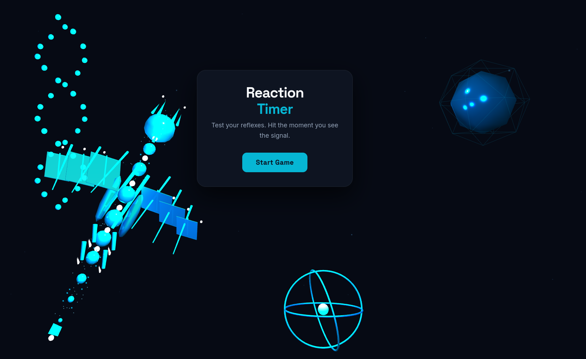

# ⚡ Reaction Timer

A portfolio-grade reaction timer game built with vanilla JavaScript and Three.js. Test your reflexes against a glowing energy dragon flying through an immersive 3D scene.

**[Live Demo →](#)**

---



---

## Overview

Reaction Timer measures how fast you respond to a visual stimulus. It tracks your results across multiple rounds, displays your best score in real time, and wraps it all in a visually striking Three.js background — purpose-built as a portfolio project to demonstrate front-end development skills.

---

## Features

- **Accurate reaction timing** — measures response time to the millisecond using the `performance.now()` API
- **5-round session tracking** — rounds tracked with dot indicators, running average, and personal best
- **Performance classification** — results graded as Excellent (<200ms), Good (200–350ms), Average (350–500ms), or Slow (500ms+)
- **Persistent Best Score HUD** — top-right overlay shows your best time, average, and round count throughout the session
- **Early click penalty** — clicking before the GO signal resets the delay with a warning
- **Keyboard support** — Space / Enter keys work across all game states
- **Fully responsive** — optimised for desktop, tablet, and mobile (portrait & landscape)
- **Mobile best practices** — safe area insets, 44px touch targets, `100dvh`, no tap flash, orientation change handling

---

## Three.js Scene

The background is a fully procedural Three.js scene — no external 3D models or assets required.

### Glowing Energy Dragon

Inspired by neon/tribal dragon aesthetics, the dragon is built entirely from Three.js primitives:

- **S-curve coiled body** — spine points follow an S-path with tapered ellipsoid segments
- **Angular swept-back wings** — dark membrane panels with glowing cyan edge lines and bone spars
- **Glowing emissive materials** — `AdditiveBlending` and high `emissiveIntensity` create a genuine neon glow
- **Energy particles** — drift off the body in real time, mimicking energy dispersal
- **Figure-8 flight path** — Lissajous curve with smooth quaternion orientation tracking
- **Reactive behaviour** — flies faster, glows brighter, and bursts on the GO stimulus

### Background Shapes

- Crystalline octahedron with wireframe cage shells
- DNA double helix with glowing strand spheres and connecting rungs
- Orrery atom model — three concentric torus rings orbiting a nucleus

---

## Game States

| State       | Description                                          |
| ----------- | ---------------------------------------------------- |
| **Idle**    | Landing screen with title and Start button           |
| **Waiting** | Random 1.5–4s delay — dragon slows, lights dim       |
| **GO!**     | Stimulus fires — dragon explodes, lights flare       |
| **Results** | Reaction time displayed, colour-coded by performance |

---

## Performance Tiers

| Tier         | Time      | Colour  |
| ------------ | --------- | ------- |
| ⚡ Excellent | < 200ms   | Cyan    |
| ✅ Good      | 200–350ms | Emerald |
| 👌 Average   | 350–500ms | Amber   |
| 🐢 Slow      | 500ms+    | Rose    |

---

## Tech Stack

| Technology                            | Usage                                     |
| ------------------------------------- | ----------------------------------------- |
| HTML5 / CSS3                          | Single-file structure, layout, animations |
| Vanilla JavaScript (ES6+)             | Game logic, state machine, timing         |
| [Three.js r128](https://threejs.org/) | 3D scene, dragon, background shapes       |
| Google Fonts                          | Space Grotesk (display) + Inter (body)    |

**No build tools. No frameworks. No dependencies to install.** Everything runs from a single `.html` file.

---

## Getting Started

### Run Locally

```bash
# Clone the repo
git clone https://github.com/your-username/reaction-timer.git
cd reaction-timer

# Open in browser — no server required for basic use
open reaction-timer.html
```

> **Note:** Some browsers restrict local file access for fonts. For best results, serve via a simple local server:

```bash
# Python 3
python -m http.server 8080

# Node.js (npx)
npx serve .
```

Then open `http://localhost:8080` in your browser.

### Deploy

This project is a single static `.html` file — deploy it anywhere:

- **Netlify Drop** — drag and drop the file at [app.netlify.com/drop](https://app.netlify.com/drop)
- **Vercel** — push to GitHub and import the repo
- **GitHub Pages** — enable Pages in your repo settings, point to `main` branch

---

## Project Structure

```
reaction-timer/
├── reaction-timer.html   # Complete application — all HTML, CSS, JS in one file
└── README.md
```

The file is organised into clearly labelled sections:

```html
<!-- HEAD -->
Meta tags, Google Fonts, Three.js CDN
<!-- STYLES -->
All CSS — responsive, mobile-first
<!-- HTML -->
Four state panels + Score HUD
<!-- THREE.JS -->
3D scene: dragon, shapes, animation loop
<!-- GAME LOGIC -->
State machine, timing, scoring, events
```

---

## Design Decisions

**Why a single file?** Portfolio projects need zero setup friction. Anyone — recruiter, engineer, or hiring manager — should be able to open the link and immediately interact with it.

**Why Three.js from CDN?** No bundler, no `node_modules`, no build step. The project stays maximally accessible and inspectable.

**Why vanilla JS?** Demonstrates core JavaScript proficiency without framework abstraction. The state machine, timing logic, and DOM manipulation are all hand-written and readable.

**Why a dragon?** The Three.js scene needed something memorable. A procedurally-built glowing energy dragon is both technically interesting and visually distinctive — exactly what a portfolio piece should be.

---

## Mobile Responsiveness

| Practice                | Implementation                                                           |
| ----------------------- | ------------------------------------------------------------------------ |
| Dynamic viewport height | `height: 100dvh` — handles mobile browser chrome                         |
| Safe area insets        | `env(safe-area-inset-*)` — works with iPhone notch & Dynamic Island      |
| Touch targets           | `min-height: 44px` on all interactive elements (Apple/Google HIG)        |
| Fluid typography        | `clamp()` on all font sizes — scales between 320px and 1440px+           |
| Tap behaviour           | `-webkit-tap-highlight-color: transparent`, `touch-action: manipulation` |
| Orientation change      | Renderer resized 150ms after `orientationchange` (iOS timing fix)        |
| Landscape phones        | Dedicated breakpoint compresses card to fit viewport height              |

---

## Colour Palette

| Role              | Hex       |
| ----------------- | --------- |
| Background        | `#0A0F1E` |
| Accent (Cyan)     | `#06B6D4` |
| Success (Emerald) | `#10B981` |
| Warning (Amber)   | `#F59E0B` |
| Danger (Rose)     | `#F43F5E` |
| Text              | `#F8FAFC` |
| Muted             | `#94A3B8` |

---

## Typography

| Role                         | Font                          |
| ---------------------------- | ----------------------------- |
| Headings, timer display, HUD | Space Grotesk (800, 700, 600) |
| Body, labels, subtitles      | Inter (600, 500, 400)         |

---

## License

MIT — free to use, fork, and adapt.
